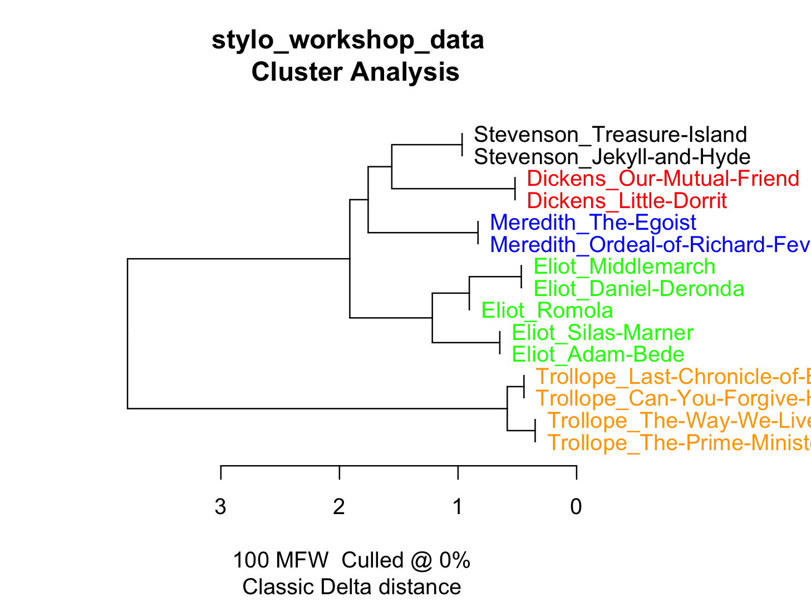

# Let us learn how to do stylometry on one's own texts

## Prerequisite: R with stylo installed

Here is the [stylo installation instruction](https://dh-network.github.io/huji-fub-school/stylometry) everyone got before the school

## Data for today
[Download zip here](https://github.com/dh-network/huji-fub-school/raw/main/stylo_workshop/stylo_workshop_data.zip) 

## Launch R or (better) Rstudio

## Run `library(stylo)` to import stylo

## Run the `stylo()` function

This all-in-one function performs the basic stylometric analysis. the `stylo` function:
* splits the texts into tokens (roughly, into words, but you can also change it character n-grams and word n-grams)
* creates the frequency tables (each text file == word frequency column/vector)
* calculates distances between these representatons of the texts
* output all these data 
* produce visualizations 
* output network data 

You'll se an interface now:

## Now, the only thing you HAVE to tell Stylo is where your texts are! 

### the easy option:  
Sometimes (depending on the OS and stylo version) the easy way works: 
1. Click OK in the interface
2. If you get asked to chose by your OS's file explorer - the easy way works for you!
3. Choose the folder INSIDE WHICH you have your **'corpus'** folder
4. In our case just navigate to one of the folders: german, english, russian etc.
5. DO NOT choose the **corpus** folder itself. Pick the folder ABOVE it.  

The folder name 'corpus' is mandatory -- it is hardcoded inside stylo :) But it can be inside any other folder with any name. On Windows beware of spaces in paths. This might acuse troubles with the complicated option:

### the complicated option: 
Sometimes (depending on the OS and stylo version) the easy way does not work. If you clicked OK and stylo jsut told you sth like 'the folder should contain the name corpus'

1. Find out the full name of the folder INSIDE WHICH you have your **'corpus'** folder (right click + get info on Mac, copy the path from explorer bar on Windows). Copy it
2. write `setwd("PATH")` replacing path by pasting the path. Keep the quotes. E.g.:
Windows: `setwd("C:\\Users\\Carla\\stylo")` (beware of spaces)
Mac/Linux:`setwd("/Users/Carla/stylo")`
3. run `stylo()` again and click `Ok`

## Now you should get the result!

## Congrats, this was really the only UNavoidable hurdle. 

Now you can already do stylometry on your material. Run your fist experiment and see the results. Let's start with the english corpus. The result without changing anything should 

## Now let us explore features. Try changing to 300 MFW:

Results shouldnt change much: 

## More feature exploration. Try changing to character Ngrams. 

the FEATURES tab, switch words to chars and make ngram size 3-4 (keeping it 1 will give you single letter freqs, which wont work)

The result should still pretty consistent even now:

Have a look into wordlist.txt and check what sort of feature you're using now. 

### At this point one might want to ask 'is it actually style we are measuring'

"I think we should lock linguists and philologists in a room and not let them leave it until they explain what is happening" (Jan Rybicki, DH 2019, Utrecht)

### A didactic task: break the stylometry

Set such features Features, that authors (chosing the wrong language does not count).

## There is a lot more to stylometry than this:

* you can combine several experiments into one dendrogram
* you can visualize it as networks of stylometric similarity (you'll be able to handle it after learning Gephi tomorrow morning)
* you can compare two sets of texts (the `oppose` function)
* you can study dynamic interference of two stylistic signal in one collaborative text

## Some  handy Stylo manuals:

* [Stylo in a nutshell](https://computationalstylistics.github.io/stylo_nutshell/)

* [STYLO_HOWTO (quite useful)](https://github.com/computationalstylistics/stylo_howto/blob/master/stylo_howto.pdf)

[Stylo developers & researchers homepage](https://computationalstylistics.github.io/)

## Bonus: the Sholokhov corpus demo:

Texts: the 'don folder'

100 MFW

200 MFW

 300 MFW

Bootstrap Consensus Tree 100 -- 300 with step 10

Network viz ()

