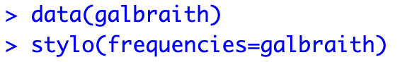
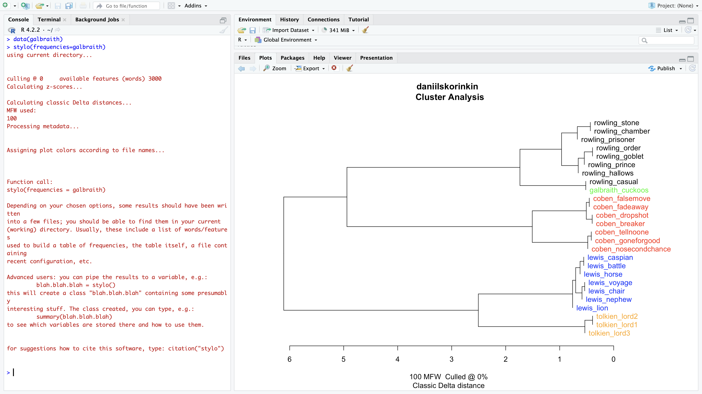

# HUJI-FUB Stylometry class (D.Skorinkin): prerequisites

### 1. Install R 

R is free software. You can download it on the official R website: https://www.r-project.org/
If you already have R and it's not too old (any version newer than 3.3.3 will do) 

### 2. Install R studio

Rstudio is free software. It is a handy IDE for R. Technically this step is not indispensable: Stylo can be used with basic vanilla R console that you have after step 1. But in rare cases there are some nasty bugs which persist in R console but disappear in Rstudio. Therefore I'd recommend getting Rstudio if possible. The official source is: https://posit.co/download/rstudio-desktop/

### 3. Run R studio (or R console) and type `install.packages('stylo')`

Like this:


### 4. Try activating stylo by typing `library('stylo')`

Like this:


Press enter after typing this. The __normal__ result is a lot of <span style="color: red">red</span> text (do not be afraid!) which mentions your version of stylo and how to cite it:

```
### stylo version: 0.7.4 ###

If you plan to cite this software (please do!), use the following reference:
    Eder, M., Rybicki, J. and Kestemont, M. (2016). Stylometry with R:
    a package for computational text analysis. R Journal 8(1): 107-121.
    <https://journal.r-project.org/archive/2016/RJ-2016-007/index.html>

To get full BibTeX entry, type: citation("stylo")
```
    
If you've got sth like this go to step 5.

##### Common errors/problems at this stage

⚠️ If you get <span style="color: red">`‘there is no package called stylo’`</span> error -- there was a problem with step 3, please return to it and try again.

⚠️ On a Mac🍎 you'd typically get this error:

```
tcltk DLL is linked to '/opt/X11/lib/libX11.6.dylib'
Error: package or namespace load failed for ‘stylo’:
 .onLoad failed in loadNamespace() for 'tcltk', details:
  call: fun(libname, pkgname)
  error: X11 library is missing: install XQuartz from www.xquartz.org
```
    
This is Ok (stylo relies on some subsystem of Windows which is absent on Mac), you just need to do as it tells you and install XQuartz from www.xquartz.org. This is basically the Mac OS emulator for this missing Windows part.   
    
### 5.  Try running these two lines below to check if everything works:
    
`data(galbraith)` click enter

`stylo(frequencies=galbraith)` click enter

Like this:


    
After executing this second line you should see an interface like this:


    
Click OK and then you should get a dendrogram like this:


    
If this worked for you, then you're all set for the stylometry workshop. 
If you have not managed to get stylo running, feel free to contact me (Daniil Skorinkin) at @skorinkin on Telegram or at skorinkin@uni-potsdam.de
