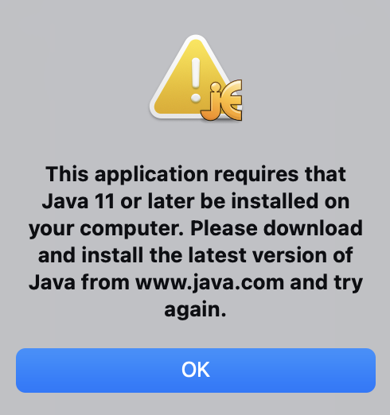

# HUJI-FUB TEI class (D.Skorinkin): prerequisites

### 1. Install jEdit or make sure you have another XML-aware editor

[Offical jEdit source](http://www.jedit.org/index.php?page=download) 

* This is not a critical prerequisite, one can use any XML editor, such as Notepad++, Sublime or OxygenXML... in the worst case even the simplest Notepad can be used to work with XML, as it is essentially still plain text (I strongly discourage this last option as extremely inconvenient :) 
* But jEdit is the only free software notepad I know of which has a dedicated TEI plugin which is aware of TEI tagset. 

### 2. Try running your editor 

For jEdit you might get asked for Java version 11 or later. Download and install the latest java [here](https://www.oracle.com/java/technologies/downloads/), restart and try running jEdit once more

#### if jEdit still does not see Java

Still getting `This application requires that java 11 or later be installed on your computer` error? Check solutions here: [https://apple.stackexchange.com/questions/426713/how-to-help-the-jedit-application-find-java](https://apple.stackexchange.com/questions/426713/how-to-help-the-jedit-application-find-java)
On MacOS you can also just 'Open Package Contents' go to the Java folder and run 'jedit.jar' file, this will launch jEdit.

### 3. Get the TEI plugin for jEdit

